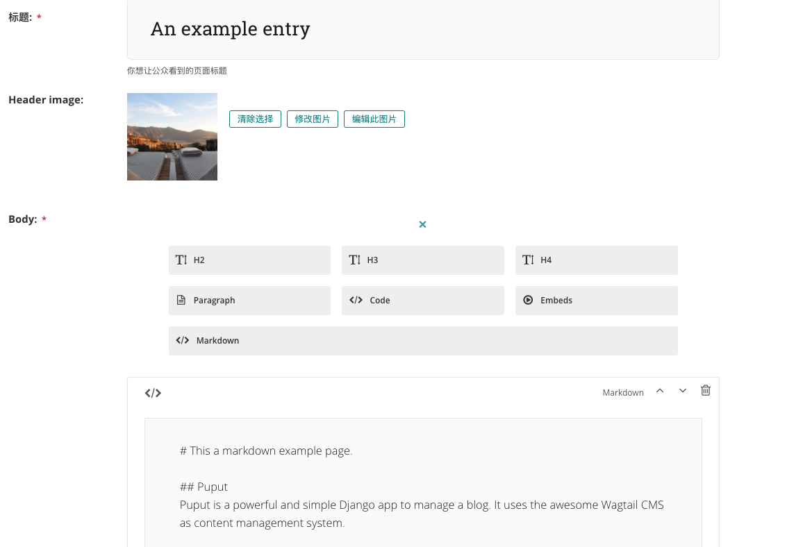
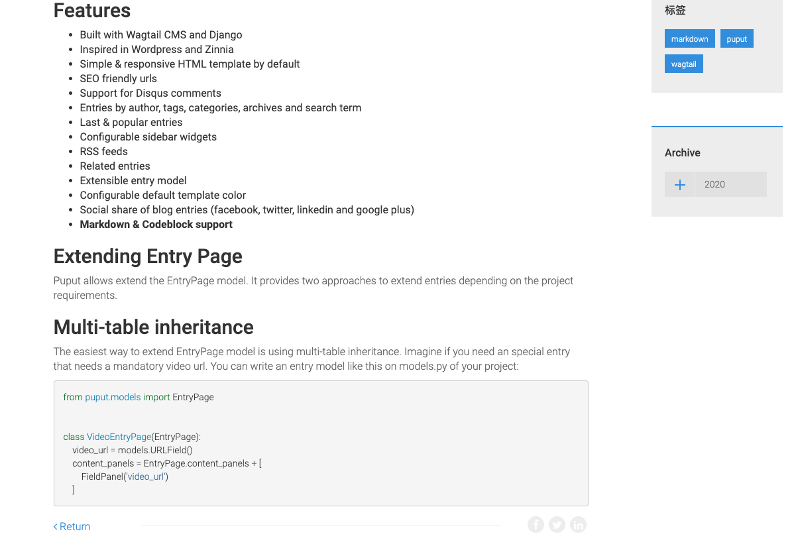

# puputblog
a puput blog with markdown and codeblock support.


## 设置开发环境

```
cd puputblog

# 创建日志目录，静态文件目录
mkdir logs && mkdir media && mkdir staticfiles

# 创建虚拟环境
python3 -m venv .venv
source .venv/bin/activate

# 安装依赖
pip install requirements_dev.txt

# 拷贝环境变量文件
cp example.env .env
./manage.py runserver

# 初始化数据库
./manage.py makemigrations
./manage.py migrate
./manage.py makecachetable

```

## 开始设置博客站点

1. 从 'blog_admin/'进入后台管理页面, 点击 'Welcome to your new Wagtail site!'页面.
2. 添加子页面，设置命名: 'my blog site', 这将是博客站点的首页，您也可以上传并设置首页头部图片。
3. 从设置->站点设置默认站点的根页面，点击localhost，设置端口，根页面为第2步设置的页面'my blog site'.

## 示例
- 编辑页面



- 前台渲染



## 关于puput entry page model扩展

confing/settings.py
```
PUPUT_ENTRY_MODEL = 'puputcodeblock.models.EntryAbstract'
```

## 一键部署

仅在ubuntu 16.04 LTS上验证。
```bash

git clone https://github.com/farlandliu/deploy-django --depth=1
cd deploy-django
git clone https://github.com/farlandliu/puputblog.git --depth=1

sudo -s
./install_os_prereq.sh
./deploy_django_project.sh puputblog example.com

```